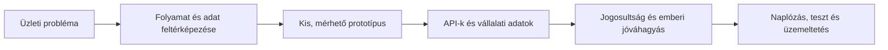

# Gál Bianka — AI & Business Automation Portfolio

> IT AI developer · multi-agent systems · business automation · API integrations · data workflows

[Magyar bemutatkozás](#bemutatkozás) · [Project menu](#project-menu) · [Tech stack](#tech-stack) · [Documents](#documents) · [Contact](#contact)

## Bemutatkozás

Üzleti folyamatokat alakítok át működő digitális rendszerekké. A projektjeim az AI-agentek, automatizációk, API-integrációk, vállalati adatfolyamok és felhasználható webes termékek metszetében készülnek.

Nem kizárólag prototípusokat készítek: a tervezés mellett foglalkozom telepítéssel, jogosultságokkal, naplózással, hibakezeléssel, dokumentációval és napi üzemeltetéssel is.

**English summary:** I build practical AI and automation systems around real business workflows. My experience includes multi-agent environments, full-stack business applications, REST/OAuth integrations, data pipelines, role-based access and human approval steps.

## Project menu

| Projekt | Mit bizonyít? | Technológia | Részletek |
|---|---|---|---|
| **OpenClaw multi-agent rendszer** | Öt elkülönített agent, saját szerepek és workspace-ek, csatornakötések, ütemezés, emberi jóváhagyás, biztonságos VPS-üzemeltetés | OpenClaw, Claude, Ubuntu, systemd, nginx, OAuth | [Esettanulmány](case-studies/openclaw-multi-agent.md) |
| **CégMotor** | Több-bérlős vállalati munkatér lead-, ajánlat-, feladat-, számla-, csapat- és AI-agent folyamatokkal | React, TypeScript, Cloudflare Workers, D1, Drizzle, OAuth | [Esettanulmány](case-studies/cegmotor.md) · [Élő demó](https://cegmotor-app.bianka1717.chatgpt.site) · [Biztonsági kódminta](https://github.com/bianka20010221-crypto/cegmotor-business-automation-showcase) |
| **Vállalati adatintegráció és BI** | Több külső rendszer közös adatmodellje, ütemezett adatbegyűjtés, QA és KPI-riporting | PHP, MySQL, REST, cron, JWT/RS256 | [Esettanulmány](case-studies/enterprise-data-hub.md) · [Kódminta](https://github.com/bianka20010221-crypto/adatrendszer-data-pipeline-showcase) |
| **AI.Trader** | Szerepkörös oktatási platform, AI mentor, szerveroldali végpontok és Telegram-integráció | JavaScript, Supabase, Cloudflare Workers, Telegram API | [Esettanulmány](case-studies/ai-trader.md) |
| **PrivateChef automatizáció** | PDF-rendelésekből ügyfél-, konyhai-, útvonal- és címkeadat; értesítési workflow | Python, OCR, Zapier, Routific, MailerLite | [Esettanulmány](case-studies/privatechef.md) · [Fiktív adatos kódminta](https://github.com/bianka20010221-crypto/privatechef-operations-automation) |
| **Marketplace és üzleti integrációk** | Webshop-, hűségprogram-, számlázási és kommunikációs rendszerek összekapcsolása | UNAS, WooCommerce, PassKit, Billingo, Számlázz.hu, Microsoft Graph | [Esettanulmány](case-studies/marketplace-integrations.md) |
| **AI translation workflow** | Tesztelhető Python workflow, magyarázható routing, emberi felülvizsgálat és biztonságos fallback | Python, CLI, JSON, unit tests | [Repository](https://github.com/bianka20010221-crypto/translation-ai-workflow-demov2) |
| **Interaktív baleseti szimulátor** | Böngészőben futó, paramétervezérelt 2D/3D mozgásmodell és első kontaktuson alapuló ütközésdetektálás | JavaScript, Canvas, Three.js, SAT | [Élő demó](https://bianka20010221-crypto.github.io/interactive-collision-simulator/) · [Repository](https://github.com/bianka20010221-crypto/interactive-collision-simulator) |
| **Moxie animált pet** | Egyedi digitális karakter teljes v2 animációs készlete, transzparencia-ellenőrzéssel és vizuális QA-val | PNG spritesheet, 8×11 state grid, QA tooling | [Repository](https://github.com/bianka20010221-crypto/moxie-animated-pet-showcase) |

## Hogyan dolgozom?

- Az AI-javaslatot és a tényleges rendszer-műveletet külön kezelem.
- Írási vagy külső művelet előtt jóváhagyási pontot építek be.
- Titkok és személyes adatok nem kerülnek a forráskódba.
- A hibás külső API nem állíthatja le indokolatlanul a teljes folyamatot.
- A prototípus mellé átadható dokumentáció és ellenőrzési pontok készülnek.

## Tech stack

| Terület | Gyakorlati eszközök |
|---|---|
| AI és agent rendszerek | OpenClaw, Claude, LLM workflow-k, multi-agent szerepek, tudásbázisok, eszkaláció |
| Programozás | JavaScript, TypeScript, Python, PHP, HTML, CSS, SQL és MySQL alapok |
| Cloud és backend | Cloudflare Workers, D1, Drizzle ORM, Supabase, REST API, cron |
| Integráció és hitelesítés | OAuth, JWT/RS256, Google, Microsoft Graph, UNAS, WooCommerce, Billingo, Számlázz.hu |
| Biztonság és működés | RLS/RBAC, AES-GCM, titokkezelés, idempotencia, retry, naplózás, emberi jóváhagyás |
| Adat és reporting | MySQL, strukturált import/export, GA4, KPI-dashboard, Excel-, PDF- és CSV-feldolgozás |

## Documents

- [IT AI Developer önéletrajz — PDF](documents/Gal_Bianka_IT_AI_Developer_CV.pdf)
- [AI és automatizációs referencia — PDF](documents/Gal_Bianka_AI_Automation_Portfolio.pdf)

## Adatvédelmi megjegyzés

A publikus repók sanitizált bemutatók. Nem tartalmaznak ügyféladatot, hozzáférési kulcsot, belső adatbázis-sémát vagy tulajdonosi forráskódot. A nem nyilvános rendszereknél az architektúrát, a saját felelősségi körömet és az eredményt esettanulmány formájában mutatom be.

## Contact

- GitHub: [@bianka20010221-crypto](https://github.com/bianka20010221-crypto)
- E-mail: [bianka20010221@gmail.com](mailto:bianka20010221@gmail.com)
- Helyszín: Szeged, Magyarország
