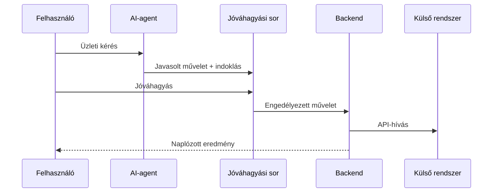

# CégMotor — AI-alapú vállalatirányítási platform

[← Vissza a projektmenühöz](../README.md#project-menu) · [Élő demó](https://cegmotor-app.bianka1717.chatgpt.site)

## Cél

Egyetlen, átlátható munkatérbe rendezni a szolgáltató vállalkozások érdeklődő-, ajánlat-, feladat-, számla-, csapat- és utánkövetési folyamatait.

## Megvalósított elemek

- több-bérlős workspace-modell;
- lead-, ajánlat-, feladat-, számla- és előfizetés-kezelés;
- szerepkörös csapathozzáférés és meghívási folyamat;
- vezetői dashboard és aktivitásnapló;
- emberi jóváhagyáshoz kötött AI-agent műveletek;
- Google Gmail és Calendar, Microsoft Graph, Billingo és Számlázz.hu integrációs réteg;
- OAuth-state ellenőrzés, PKCE és titkosított credential-tárolás.

## Kapcsolódás ERP/Business Central környezethez

A projekt üzleti entitások, workflow-k, jogosultságok, auditálhatóság és külső rendszerkapcsolatok egységes kezelését mutatja. Business Central/AL tapasztalatot nem állítok; ezt a területet a meglévő REST API-, adatmodell- és workflow-tapasztalatra építve tanulom.

**Technológia:** React · TypeScript · Cloudflare Workers · D1 · Drizzle ORM · REST API · OAuth · AI-agent

