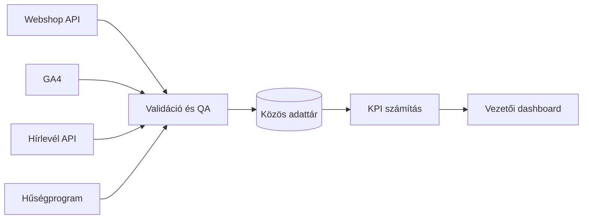

# Vállalati adatintegráció és BI dashboard

[← Vissza a projektmenühöz](../README.md#project-menu) · [Sanitizált kódminta](https://github.com/bianka20010221-crypto/adatrendszer-data-pipeline-showcase)

## Cél

Webanalitikai, webshop-, hírlevél- és hűségprogram-adatok összekapcsolása egy közös, vezetői riportolásra alkalmas adatmodellben.

## Megoldás

- ütemezett adatbegyűjtés négy külső rendszerből;
- forrásonként elkülönített hibakezelés;
- duplikáció- és dátumellenőrzés betöltés előtt;
- közös normalizált adatmodell;
- automatikus KPI-számítás és vezetői nézetek;
- saját JWT/RS256 hitelesítési minta `openssl_sign()` használatával;
- strukturált naplózás és frissességi ellenőrzés.

**Technológia:** PHP · MySQL · REST API · cron · GA4 · UNAS · MailerLite · PassKit · JWT/RS256

