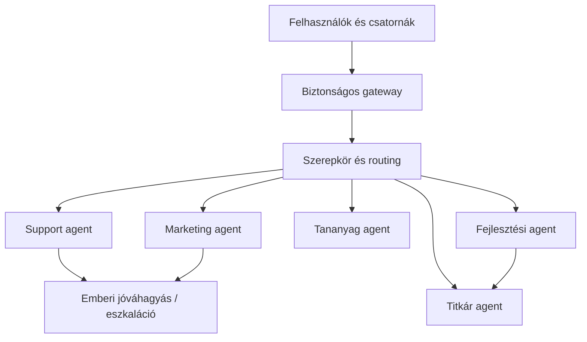

# OpenClaw multi-agent vállalati rendszer

[← Vissza a projektmenühöz](../README.md#project-menu)

**English summary:** A permission-aware multi-agent environment with isolated roles, workspaces, channels, schedules and approval boundaries, operated on a persistent VPS deployment.

## A probléma

Több, egymástól eltérő vállalati feladatot kellett úgy AI-agentekhez rendelni, hogy a szerepek, a tudás, a csatornák és a hozzáférések ne keveredjenek össze, a rendszer pedig tartósan és ellenőrizhetően üzemeljen.

## A megoldás

Öt elkülönített agentet alakítottam ki:

1. tananyag;
2. marketing;
3. support;
4. titkár;
5. trendkutató és termékfejlesztő.

Mindegyik agent saját workspace-t és szerepleírást kapott. A support és marketing agent külön kommunikációs csatornához köthető, a fejlesztési agent pedig ütemezetten készíthet jelentést, amelyet a titkár agent foglal össze.

## Saját feladatom

- VPS-környezet és nem root szolgáltatás kialakítása;
- systemd user service és automatikus indulás;
- nginx reverse proxy, HTTPS és WebSocket kapcsolat;
- szerepek, workspace-ek és működési szabályok kialakítása;
- csatorna-hozzárendelés és időzített futások megtervezése;
- mentési, restore- és migrációs runbook;
- korlátozott fájlfeltöltés és távoli adminisztráció;
- OAuth-alapú személyazonosítás, operator szerepek és jóváhagyási pontok tervezése.

## Miért releváns vállalati környezetben?

A multi-agent rendszer nem pusztán több chatbot. Elkülönített felelősségekre, jogosultságokra, adatforrásokra, mérhető feladatokra és emberi döntési pontokra van szükség. A projekt ezt a teljes működési szemléletet bizonyítja a telepítéstől az üzemeltetésig.

## Biztonsági elvek

- a gateway csak a szükséges hálózati felületen érhető el;
- az operátori és felhasználói hozzáférés különválik;
- a tool-hozzáférések allow/deny szabályokkal korlátozhatók;
- külső vagy írási művelethez emberi jóváhagyás rendelhető;
- a helyreállítás dokumentált és tesztelhető.

**Technológia:** OpenClaw · Claude · Ubuntu 24.04 · Node.js · systemd · nginx · WebSocket · Google OAuth · Telegram · Discord
