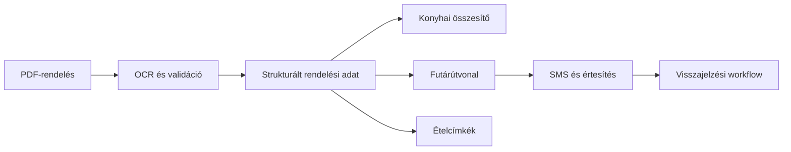

# PrivateChef rendelési és operációs automatizáció

[← Vissza a projektmenühöz](../README.md#project-menu)

## Kiinduló helyzet

A rendelési adatok PDF-ekben és különálló rendszerekben érkeztek. A konyhának, futárnak, ügyfélkommunikációnak és címkenyomtatásnak ugyanabból a forrásból, de eltérő formában volt szüksége adatokra.

## Automatizált folyamat

## Eredmény

- ügyfél- és rendelésazonosítás;
- nap/persona bontás és külön konyhai összesítő;
- futárlista és útvonaltervezési adat;
- Brother P-touch címkeadatbázis;
- futárértesítés és elágazó visszajelzési folyamat;
- ellenőrzési pontokkal ellátott üzemeltetési tudásbázis.

**Technológia:** Python · OCR · PDF · Excel · CSV · Zapier · Routific · MailerLite · Brother P-touch

